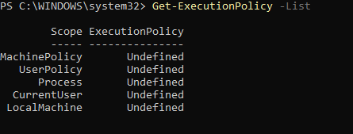
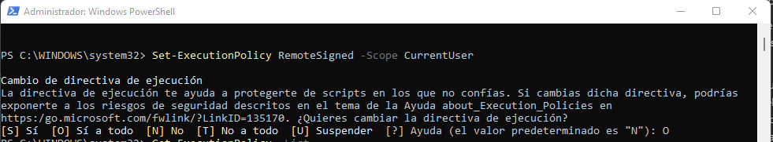

# Powershell-backups
 Power shell script to create backups on windows
## Revisar ejecución de scripts **Windows Policies** 

>**Tipos de políticas de ejecución de Powershell
PowerShell tiene varias políticas de ejecución, cuatro de las más usadas son:** 
>
>1. **Restricted:** ningún script será ejecutado. Como comentaba anteriormente, esta es la configuración predeterminada.
>
>2. **RemoteSigned:** permiten ejecutar los scripts creados localmente con firma remota. Los scripts que se crearon en otra máquina no se ejecutarán a menos que estén firmados por un editor de confianza.
>
>3. **AllSigned:** los scripts solo se ejecutarán si está firmado por un editor de confianza. Aquí también se incluyen los scripts creados localmente.
>
>4. **Unrestricted:** todos los scripts se ejecutarán, da igual quién los haya creado y si están o no firmados. 
>
>Para poder ver la política actual de ejecución abriremos PowerShell a nivel administrador. Para ello deberemos hacer clic en Inicio, escribir "Windows PowerShell", hacer clic con el botón derecho encima de la aplicación y finalmente hacer clic en "Ejecutar como administrador".

Abrir un PowerShell como Administrador y ejecutar
~~~
Get-ExecutionPolicy -List 
~~~

Para cambiar
~~~
Set-ExecutionPolicy RemoteSigned -Scope CurrentUser ​
~~~
