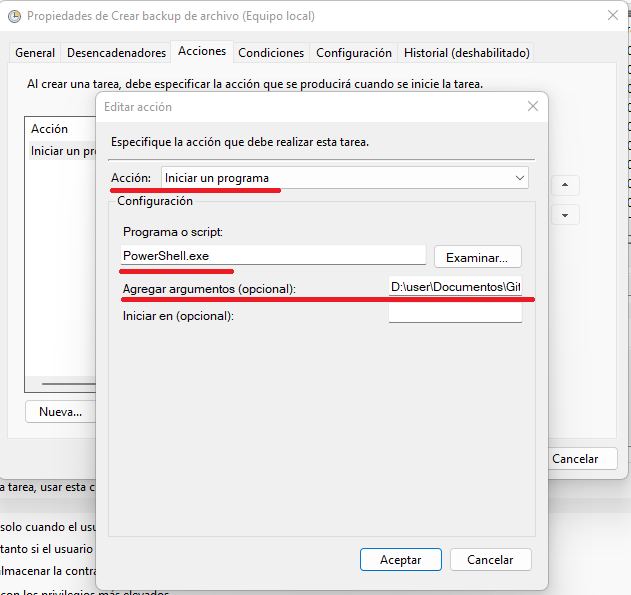

# Powershell backups
 Power shell script to create backups on Windows
## Politica de ejecución de scripts en Windows
---

>**PowerShell tiene varias políticas de ejecución, cuatro de las más usadas son:** 
>
>1. **Restricted:** ningún script será ejecutado. Como comentaba anteriormente, esta es la configuración predeterminada.
>
>2. **RemoteSigned:** permiten ejecutar los scripts creados localmente con firma remota. Los scripts que se crearon en otra máquina no se ejecutarán a menos que estén firmados por un editor de confianza.
>
>3. **AllSigned:** los scripts solo se ejecutarán si está firmado por un editor de confianza. Aquí también se incluyen los scripts creados localmente.
>
>4. **Unrestricted:** todos los scripts se ejecutarán, da igual quién los haya creado y si están o no firmados. 

Abrir un PowerShell como Administrador y ejecutar
~~~
Get-ExecutionPolicy -List 
~~~

Para cambiar
~~~
Set-ExecutionPolicy RemoteSigned -Scope CurrentUser ​
~~~

Revisar nueva configuración
~~~
Get-ExecutionPolicy -List ​
~~~

Ahora ya se puede ejecutar el script de PowerShell
~~~
./powershell-backups.ps1 D:\user\Documentos\Sintitulo.mp4
~~~

## Crear tarea programada en Windows
---
1. Abre el Programador de tareas de Windows

2. Vete a **Acccion** -> **Crear una nueva tarea**

3. En la pestaña **General** llena los siguientes datos
    - Nombre
    - Descripción
    - Selecciona *Ejecutar solo cuando el usuario haya iniciado sesión*
    - Y cambia la **Configuración** para *Windows 10*

4. Cambia a la pestaña **Desencadenadores**, click en **Nuevo**

    Llena los campos necesarios de acuerdo a tu programación, puede ser diariamente, semanal o mensual. Y puedes elegir como se ejecuta, por ejemplo cuando se inicie la sesión o según programación (*Según programación* es a demanda y puedes programarlo) 

    ***NOTA:** en caso de que ya exista un desencadenador creado, puedes modificarlo o agregar nuevos*

5. Cambia a la pestaña **Acciones**, click en **Nueva**

    Selecciona **Acción:** *Iniciar un programa*.
En **Examinar** escribe *PowerShell.exe* y en **Agregar Argumentos** agrega el path completo del script, seguido de un espacio y el path completo del archivo a crear el backup. Por ejemplo:

    *D:\user\Documentos\powershell-backups.ps1 D:\user\Documentos\Sintitulo.mp4*

6. En la pestaña **Condiciones** revisar los valores y modificar dependiendo el equipo. *Configuración recomendada:*

7. En la pestaña **Configuración**  revisar los valores y modificar dependiendo el equipo. *Configuración recomendada:*

8. Para finalizar, click en **Aceptar**

9. Revisar y confirmar que está corriendo

#### Bibliografia
---
[Ejecucion de scripts PowerShell](https://www.cdmon.com/es/blog/la-ejecucion-de-scripts-esta-deshabilitada-en-este-sistema-te-contamos-como-actuar)

[Programar tareas en Windows 10](https://www.genbeta.com/paso-a-paso/como-programar-tareas-en-windows-10)
